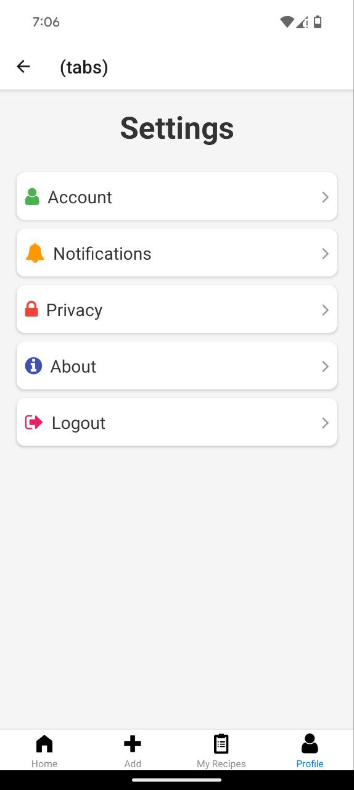
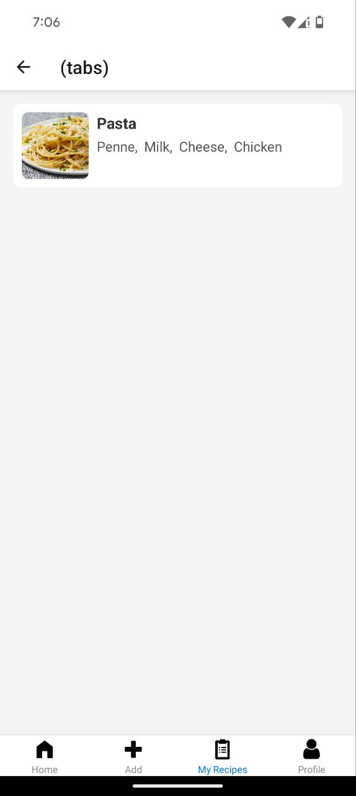
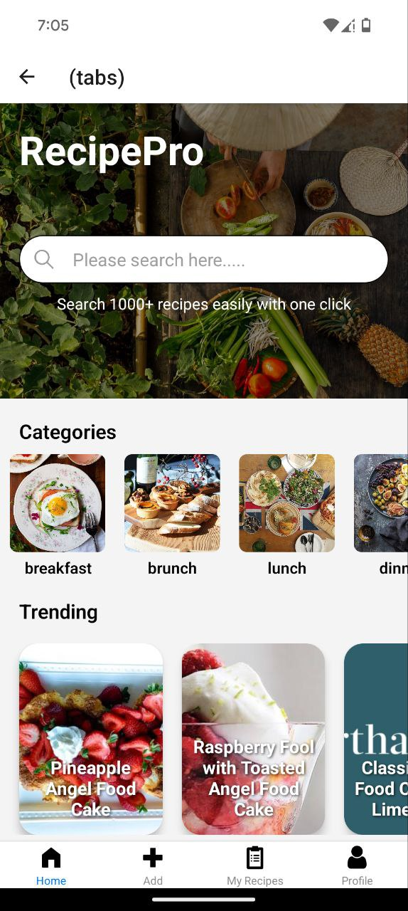
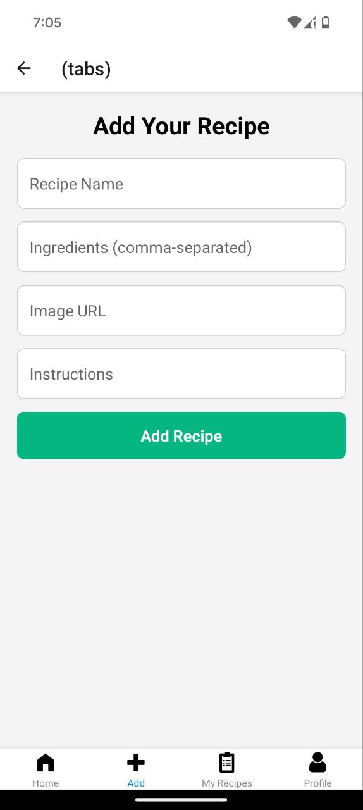

<h1 align="center">🍽️ Master-Chef 🍽️</h1>

  <i>An app built with <b>React Native</b> where you can find a recipe of any cuisine! 🥘</i>

  
  
  
  
  

<h2>🚀 Features</h2>
<ul>
  <li>🔍 Search for recipes from various cuisines around the world</li>
  <li>👨‍🍳 Step-by-step cooking instructions for each recipe</li>
  <li>⭐ Favorite recipes and access them offline</li>
  <li>📊 Track popular recipes and trends</li>
</ul>

<h2>🛠️ Installation</h2>
<h2>🔧 Configuration</h2> 
Before running the app, make sure to modify the hosted backend URL in <code>config.js</code> file to define the API endpoint for logging in into the app and fetching recipes.
 <h3>Setup Instructions</h3>
<pre>
git clone https://github.com/ManmohanBoyina/master-chef.git
cd Master-chef
cd MasterChef
npm install
npm expo start
</pre>

<h2>📱 Technologies Used</h2>
<ul>
  <li><b>React Native</b> - Cross-platform mobile development</li>
  <li><b>Expo</b> - React Native development environment</li>
  <li><b>Axios</b> - To fetch recipes from the API</li>
  <li><b>React Navigation</b> - Seamless navigation in the app</li>
</ul>

<h2>📸 Screenshots</h2>

  
  
  
  
  
  

